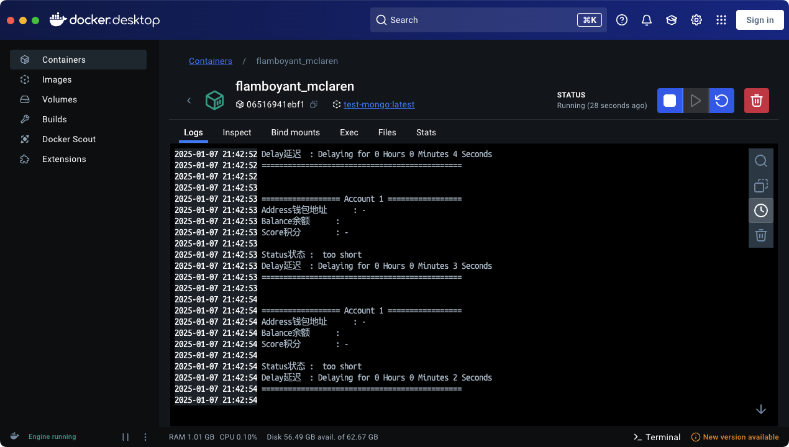

## MANGO TESTNET AUTO BOT

## 欢迎关注我的推特(https://x.com/xwxboring)

## 注册阶段需要做的事情

- [下载芒果钱包](https://chromewebstore.google.com/detail/mango-wallet/jiiigigdinhhgjflhljdkcelcjfmplnd)
- [创建钱包且备份密钥] Backup Phrase
- [打开注册地址绑定钱包](https://task.testnet.mangonetwork.io/?invite=Nng237)
- [完成推特、DC、TG的绑定](https://task.testnet.mangonetwork.io/?invite=Nng237) 绑定完成之后点击 [Join now]
- [任务页](https://task.testnet.mangonetwork.io/events)
- Login Daily

**LFG**

## PREREQUISITE 前值依赖

- Git (可选)
- Node JS (v22) (必须)

## BOT FEATURE 机器人功能

### 目前支持的功能

- Multi Account 多账户支持，多个钱包延迟启动避免被女巫
- Support PK 支持私钥导入
- Proxy Support 支持 IP 代理
- Daily Claim Faucet 每日领取水龙头 discord需要人工手动去发，脚本已移除dicord任务，发完之后人工去点击提交
- Daily Check In 每日签到 2分递增
- Daily Mango Swap 每日 Swap 任务 3分
- Daily BeingDex Beta DAPP 15分
- 每日 BeingDex 任务 10分 需要用app去点击，脚本提交不生效已移除
- Daily Bridge 每日跨链桥任务 不支持

## SETUP & CONFIGURE BOT

### LINUX 系统使用步骤

1. Clone project repository 可通过 git clone 或者直接去仓库 Download ZIP 解压
   ```
   git clone https://github.com/OCISHY/Mango-Testnet-Auto-Bot.git && cd Mango-Testnet-Auto-Bot
   ```
2. Install Dependencies and Setup Accounts 安装依赖
   ```
   npm install && npm run setup
   ```
3. Configure your accounts 配置钱包私钥和 proxy代理
   ```
   nano app/config/index.js
   ```
4. To run Auto TX 运行脚本
   ```
   npm run start
   ```

### WINDOWS / MAC 系统使用步骤

1. Open your `Command Prompt` or `Power Shell`.
2. Clone project repository 可通过 git clone 或者直接去仓库 Download ZIP 解压
   ```
   git clone https://github.com/OCISHY/Mango-Testnet-Auto-Bot.git
   ```
   and cd to project dir
   ```
   cd Mango-Testnet-Auto-Bot
   ```
3. Install Dependencies and Setup Accounts 安装依赖
   ```
   npm install && npm run setup
   ```
4. 在 `Mango-Testnet-Auto-Bot/accounts/accounts.js` 文件中配置账号私钥
5. 在 `Mango-Testnet-Auto-Bot/config/proxy_list.js` 文件中按需要配置 IP 代理
6. 在 `Mango-Testnet-Auto-Bot` 目录下打开命令行 `Command Prompt` or `Power Shell` .
7. 执行脚本
   ```
   npm run start
   ```

## 代码更新之后同步更新

如果使用的 git 拉取仓库执行以下命令 :

1. 执行
   ```
   git pull
   ```
   或者
   ```
   git pull --rebase
   ```
   如果报错执行以下
   ```
   git stash && git pull [git stash命令会移除你本地对这个代码的修改谨慎使用， 如果需要还原可执行 git stash pop]
   ```
2. 更新依赖包
   ```
   npm update
   ```
3. 更新完成之后重新执行 npm run start 启动脚本
4. 错误日志地址: `log/app.log`

## 增加 docker 部署支持

提前配置好 app/config/index.js 如果要修改就必须重新执行1、2步骤
用docker部署方便管理，使用教程自行google/baidu

1. 在项目目录下运行，生成镜像，mongo-bot名字可自定义

```
docker build -t mango-bot .
```

2. 基于镜像启动容器

```
docker run -d mongo-bot .
```



## IMPORTANT NOTE (READ IT THIS IS NOT DECORATION)

DYOR & Always use a new wallet when running the bot, I am not responsible for any loss of assets.
请自行研究并始终使用新钱包运行机器人，我不对任何资产损失负责.

## LICENSE

This project is licensed under the MIT License. See the [LICENSE](LICENSE) file for more details.
